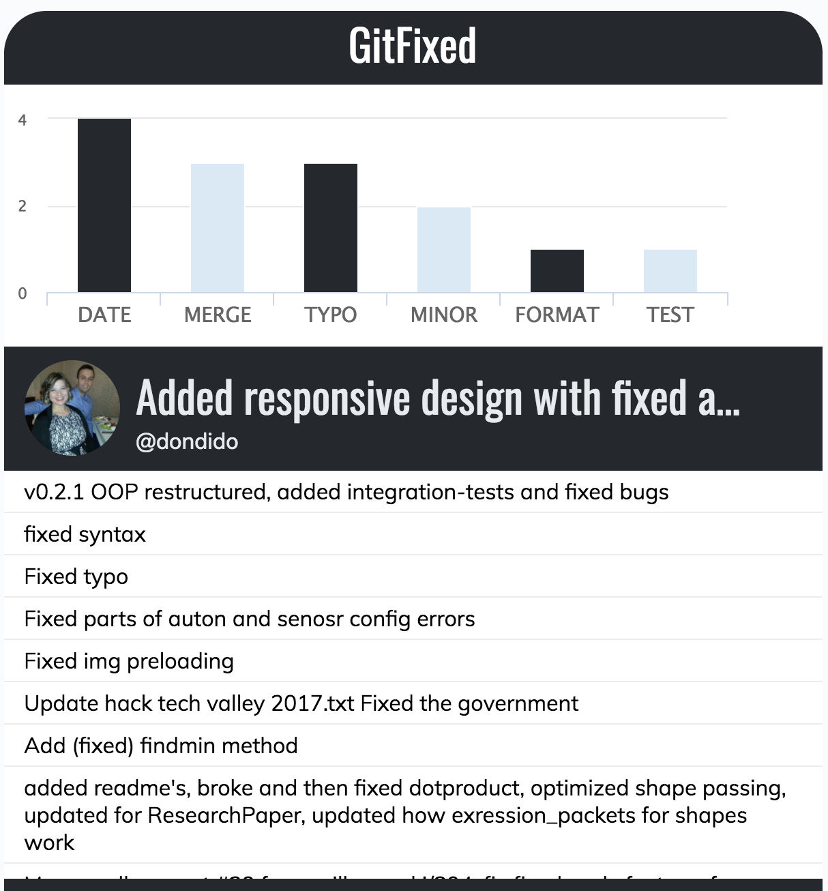

# GitFixed
A real-time data visualization of the public GitHub feed

http://gitfixed.azurewebsites.net/

This visualization queries the GitHub commit search API for commits that contain the word 'fixed' in the commit message and streams them in to the browser.

The messages are parsed for different keywords and the frequency is charted in real time.

